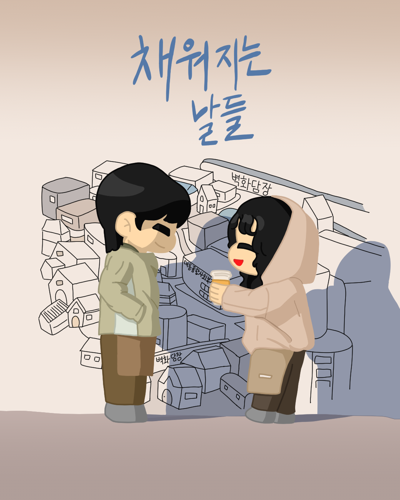
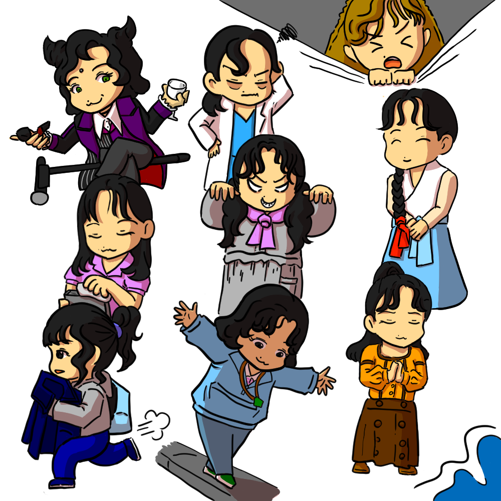
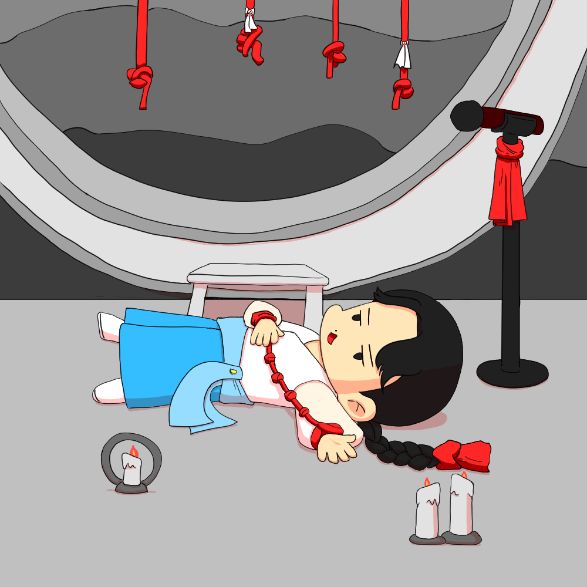

<html>
<head>
  <title>찐 아카이브</title>
  <link href="https://fonts.googleapis.com/css2?family=Pretendard&display=swap" rel="stylesheet">
  <meta name="viewport"
    content="width=device-width,
    initial-scale=1.0">
  

</head>

<body>
  

   <h1>찐's 아카이브</h1>

  

   
   

  
  
  
  

  

</body>

</html>
